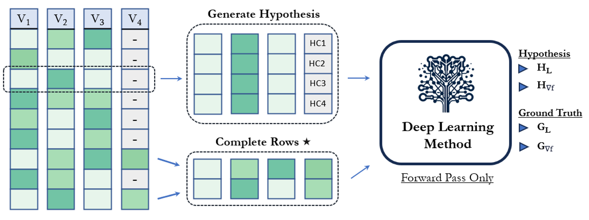
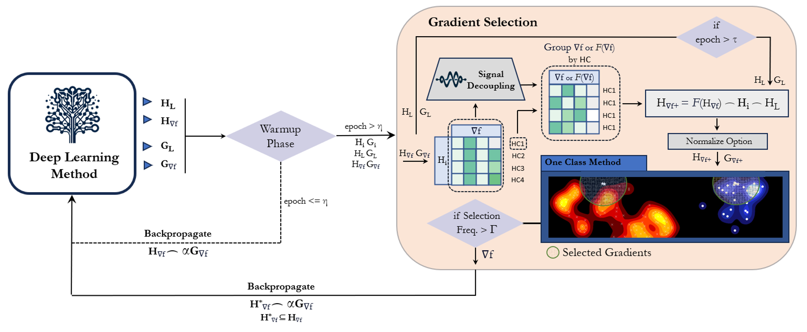

# GGH: Gradient Guided Hypotheses

**GGH** is an algorithm that uses clustering of enriched gradients to differentiate patterns (noise, correct/incorrect hypotheses) in the data. 

---
## Install
	git clone https://github.com/schwallergroup/gradient_guided_hypotheses.git
	cd gradient_guided_hypotheses
	conda env create -f bee38.yml
	pip install --no-cache torch==1.8.2+cu111 torchvision==0.9.2+cu111 torchaudio==0.8.2 -f https://download.pytorch.org/whl/lts/1.8/torch_lts.html

---
### Method
**GGH** can be used to differentiate non-noisy from noisy datapoints, or by augmenting the dataset with hypotheses for missing values, it can be used to differentiate correct hypotheses for the missing values from incorrect ones. Importantly, this technique differentiates between contradictory hypotheses and benign hypotheses or even identify cases where multiple inputs would have led to the same outcome. For this reason, benchmarking of imputation should focus on final model performance rather than selection of an exact missing value.

The gradients can be derived from anytype of deep learning model making this an architecture agnostic approach.

Schematic of data augmentation through hypotheses for missing values:

  

Schematic of gradient guided algorithm:

  

### Associated Publication 
This code relates to a pre-print available on...

### License
All the code in this repository and the GGH package is under the MIT License.

